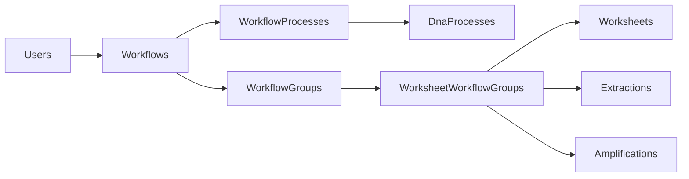
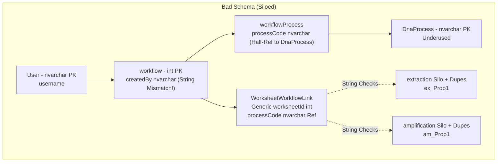
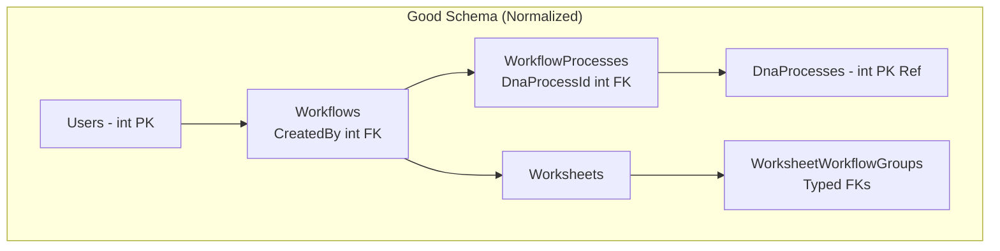

# DNA Workflow API Showcase


This repository showcases a scalable .NET 9 Web API for managing DNA lab workflows, drawing from real-world lab operations. At its core is a hierarchical model: Managers define reusable workflow templates with ordered DNA processes (e.g., extraction → amplification → quantification) for teams. Workers select a template to create runs (WorkflowGroups), instantiating worksheets (step instances) with process-specific props like yield or cycles. This supports multi-user collaboration—e.g., intersecting workflows from different workers can merge into a shared group via `StepOrder` for flexible sequencing, minimizing redundant steps and cutting costs. Normalized junctions (e.g., WorkflowProcesses) ensure scalability without duplication.

The goal is to highlight:
- **Data modeling for complex lab processes**: Ordered sequences and process-specific props in a 3NF+ schema.
- **RESTful endpoints**: Full CRUD plus custom ops (e.g., add-process to workflows).
- **Frontend integration**: React stub in `/client` for demos (my first React project—expanding soon!).

## Features
- **Scalable Schema**: Normalized design (3NF+) with junction tables for many-to-many relationships (e.g., workflows to processes, worksheets to groups). Supports multi-user sharing of worksheets at varying orders via `StepOrder` per group.
- **RESTful APIs**: Full CRUD for Users, DnaProcesses, Workflows, and WorkflowGroups. Custom actions like adding processes to workflows with validation (no dups per WF). Endpoints use async EF queries with projections to avoid cycles.
- **Seeded Data**: Baseline with 4 users (Admin, Technicians, Analyst), 3 processes, 1 default workflow with ordered steps, and a sample run with worksheets/step props.
- **No Cascade Cycles**: FKs configured with `ON DELETE NO ACTION` to prevent SQL Server errors in complex deletes.
- **React Integration**: Basis frontend stub in /client for API demos (e.g., users table); full UI planned.

## Frontend
The repository includes a basic React frontend stub in the `/client` folder to showcase API integration. It fetches and displays the seeded users in a simple table, demonstrating live data loading from the backend.

### How to Run the Frontend
1. **Install Dependencies** (in repo root):
cd client
npm install

2. **Start the React App**:
- Run 'npm start'
- Opens http://localhost:3000—shows the Users table populated from `/api/users`.
- Ensure the API is running (`dotnet run`) for data.

3. **Tech**: Create React App with TypeScript, Axios for API calls. Expandable for full UI (e.g., workflow builder).

See `/client/src/App.tsx` for the Users component. Future: Add forms for CRUD, routing, and styling (e.g., Material-UI).

## Schema Overview
The core is a hierarchical model:
- **Users**: Owners/analysts (with enum roles: Admin, Technician, Analyst).
- **DnaProcesses**: Reusable steps (e.g., Extraction with props like yield/purity).
- **Workflows**: Templates with ordered processes (via junction `WorkflowProcesses`).
- **WorkflowGroups**: Concrete runs/instances of workflows.
- **Worksheets**: Step instances linked to groups (many-to-many via `WorksheetWorkflowGroup` with `StepOrder` for per-run ordering).
- **Step Tables** (Extraction, Amplification, Quantification): Process-specific props (Prop1/Prop2 placeholders).

ERD (generated from dbdiagram.io): Full interactive diagram [here](https://dbdiagram.io/d/Scalable-Workflows-Worksheets-68dd4368d2b221e422d0865c).


See `dbdiagram.io` link in commit history for full DBML.

## API Endpoints
All at `/api/{controller}` (e.g., `/api/workflows`). Test in Swagger at `/swagger`.

| Controller | Method | Endpoint | Description |
|------------|--------|----------|-------------|
| **Users** | GET | /users | List all users. |
| | GET | /users/{id} | Get user by Id. |
| | POST | /users | Create user (e.g., {"userName": "newtech", "userType": 1}). |
| | PUT | /users/{id} | Update user (body Id must match path). |
| | DELETE | /users/{id} | Delete user. |
| **DnaProcesses** | GET | /dnaprocesses | List processes with creators. |
| | GET | /dnaprocesses/{id} | Get process by Id. |
| **Workflows** | GET | /workflows | List workflows with ordered processes. |
| | GET | /workflows/{id} | Get workflow with ordered processes. |
| | POST | /workflows | Create workflow (e.g., {"name": "Test WF", "createdBy": 1}). |
| | POST | /workflows/{id}/add-process | Add single process (e.g., {"dnaProcessId": 1, "processOrder": 1}). |
| | PUT/DELETE | /workflows/{id} | Update/delete. |
| **WorkflowGroups** | GET | /workflowgroups/{id}/report | Ordered report of run (worksheets + processes). |

*Note*: DnaProcesses are ref data—seed via SQL inserts for dev (e.g., `INSERT INTO DnaProcesses (Name, Description) VALUES ('Purification', 'Cleanup step');`). New processes require adding a specific table (e.g., Purifications) and specimen pattern (e.g., PurificationSpecimen) to match schema.

Swagger: [localhost:7049/swagger](https://localhost:7049/swagger) (dev mode).

## Tech Stack
- **Backend**: .NET 9, ASP.NET Core Web API, EF Core 8+ (code-first migrations).
- **Database**: SQL Server (LocalDB for dev; conn in appsettings.json).
- **Tools**: Swagger for docs/testing, dbdiagram.io for ERD.
- **Frontend**: React (with Axios for API calls, React Router for pages like Workflow Builder).

## How to Run
1. **Clone & Restore**:
   
```git clone https://github.com/Serk4/DotNetCoreWebApi.git```

```cd DotNetCoreWebApi```

```dotnet restore```

2. **Update DB** (runs migrations + seed):

```dotnet ef database update```

3. **Run Backend**:
   
```dotnet run```

- API at `https://localhost:7049`.
- Swagger at `https://localhost:7049/swagger`.

4. **Run Frontend**:
   
```cd client```

```npm install```

```npm start```

- App at `http://localhost:3000`

5. **Test**: Use Swagger for API, React for UI. CORS enabled for local dev.

## Future Plans
- **React Frontend**: Expand to workflow builder (drag-drop processes), run dashboard, and real-time sharing.
- **Auth**: JWT with role-based access (e.g., Analysts only for worksheets).
- **Advanced**: Batch process addition, workflow validation (e.g., required steps), file uploads for lab data.
- **Deployment**: Docker + Azure/AWS for scalability.

## Contributing
Fork, branch, PR! Focus on schema tweaks, new endpoints, or React integration.

# Schema Design Notes — "Worked" vs Scalable

This document captures lessons learned migrating from a legacy, "it-works" siloed schema to the normalized schema used in this project. It documents the flaws I encountered in production systems and how the app's schema (see `Models.cs`) addresses them.

DBML of legacy schema (worked, but unscalable): https://dbdiagram.io/d/Not-Scalable-Workflows-Worksheets-6903d2e86735e11170910382

## TL;DR
Short-term hacks made things functionally correct, but amplified maintenance cost, risk, and developer time. The normalized design here favors consistent PK/FK types, typed junctions, and a single `Worksheet` model that can handle any `DnaProcess`.

## Problem Summary (Legacy)
- Mixed key types (e.g., `username`/nvarchar used as FK) cause join mismatches and slow plans.
- Per-process silo tables duplicated schema & business logic (~12 copies).
- Loose links via codes/strings (`processCode`) require fragile string-check logic and brittle migrations.
- Adding a new DNA step meant copy/paste work and multi-week hotfixes.

## What This App Fixes
- Consistent integer PKs/FKs (`int`) across `Users`, `Workflows`, `DnaProcesses`, `Worksheets`.
- Typed junction tables: `WorkflowProcess`, `WorksheetWorkflowGroup` — explicit FKs prevent silent mismatch.
- Single `Worksheet` table + typed FKs to `DnaProcess` eliminates per-process duplication—scaling a new DNA process is a breeze: SQL insert to ref + 1-2 new tables (specific props + specimen pattern), vs. legacy's copy-paste of a dozen tables followed by tedious renaming/hotfixes.
- Seeded data and queries are performant and predictable.

## Comparison (Legacy vs This App)
| Problem Area | Legacy ("Worked") | This App (Normalized) |
|:--------------|:-------------------|:-----------------------|
| Key Types | Mixed (nvarchar PKs referencing usernames) | Int PKs everywhere (`Id`) — predictable joins |
| Process Modeling | Siloed per-process tables and string links | `DnaProcess` as hub; `WorkflowProcess` typed FK |
| Adding a Process | Create tables + duplicate code | Add a `DnaProcess` + seed; reuse junctions |
| Referential Integrity | Enforced by application string checks; brittle | Enforced by DB FKs; easier to reason about |
| Performance | Slow joins across heterogenous types | Fast integer joins; simpler indices |

## Migration Rationale
- Use explicit FK configuration in `OnModelCreating` to avoid cascade cycles where necessary.
- Prefer `DeleteBehavior.NoAction` when cascading would create multiple paths; otherwise use `Cascade` where semantics require children removed with parent.
- When deleting `Workflow`, ensure dependent `WorkflowProcess` rows are removed or configure cascade explicitly.

## Quick Deletion Pattern
If you need to delete a `Workflow` safely in code (avoid FK constraint failures):

```csharp
// Example: Soft-delete or manual cleanup before hard delete
var workflow = await _context.Workflows.FindAsync(id);
if (workflow != null)
{
    // Cleanup dependents first (e.g., unlink groups)
    var groups = await _context.WorkflowGroups.Where(g => g.WorkflowId == id).ToListAsync();
    foreach (var group in groups)
    {
        _context.WorkflowGroups.Remove(group);  // Or set FK null
    }
    await _context.SaveChangesAsync();
    _context.Workflows.Remove(workflow);
    await _context.SaveChangesAsync();
}
```

## Next Steps / Gotchas
- Review `OnModelCreating` FKs and `DeleteBehavior` choices before enabling cascade deletes; multiple cascade paths can be refused by SQL Server.
- Add tests for common schema migrations (adding/removing DnaProcess) to validate no-cascade surprises.
- Consider soft-delete if you need audit/history without complex cascade rules.

Fork, iterate, and avoid creating new silos. Normalize once; then scale.





## License
MIT—free to use/fork for your lab apps or showcases.
